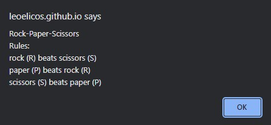

# Rock, Paper, Scissors

 

In this activity I built a game of Rock, Paper, Scissors in Javascript. I wrote this program to learn about Array methods and also the alert(), confirm() and prompt() methods in Javascript. It helped me understand what a function is and how useful it can be.

## Usage

The game can be played by opening [Rock Paper, Scissors](https://leoelicos.github.io/bcs-03-rock-paper-scissors/) in Google Chrome.

### Screenshots

#### Rock, Paper, Scissors

## Credits

2U's Trilogy Bootcamp Resources

## Licence

MIT Licence © 2022 Leo Wong
